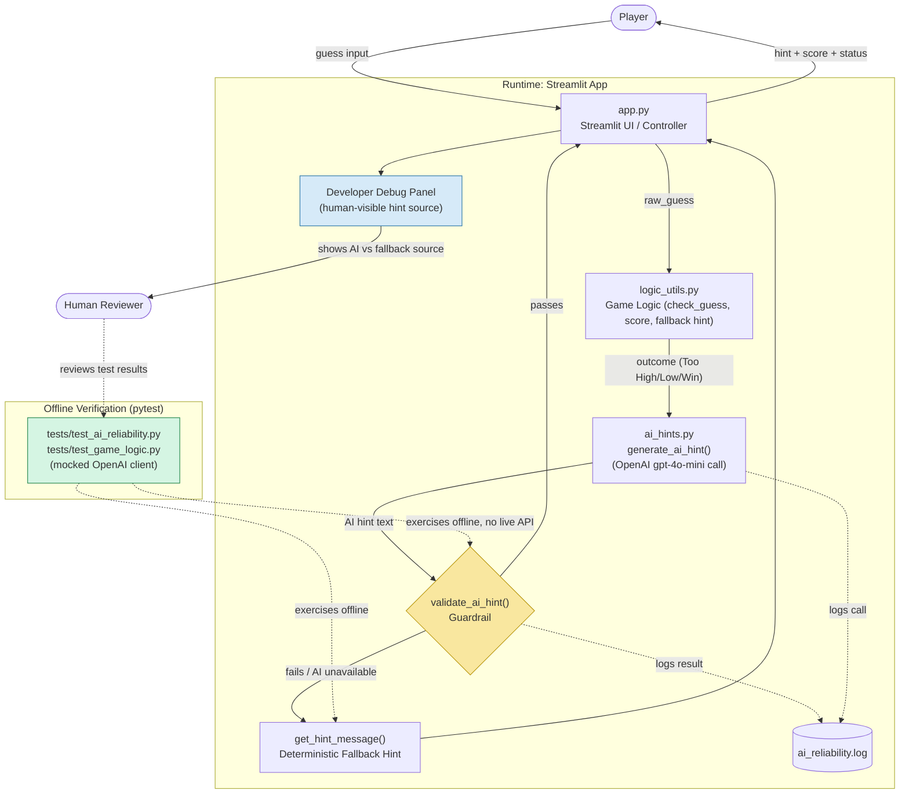

# System Diagram — Glitchy Guesser

## Notes

- **Data flow (solid arrows):** Player guess → `app.py` → `logic_utils.check_guess` → `ai_hints.generate_ai_hint` (calls OpenAI) → `validate_ai_hint` guardrail → either the AI hint or the deterministic fallback is shown back to the player.
- **Logging (dotted arrows into `ai_reliability.log`):** every AI call and guardrail decision is logged, whether the AI hint passed, failed, or the API call errored.
- **Human check-in:** the Streamlit "Developer Debug Info" panel exposes which source (`ai` or `fallback`) produced the last hint, letting a human observe AI reliability during a live session.
- **Automated testing (green subgraph):** `tests/test_ai_reliability.py` mocks the OpenAI client and asserts the guardrail rejects bad hints (contradictory direction, leaked numbers, empty/overlong text) and that the fallback path works — this is the safety net that runs before any code change reaches a real player.
